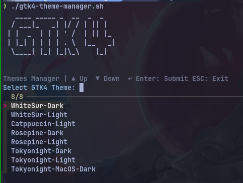

# gtk4-theme-manager
A lightweight, terminal-centric bash script to instantly swap GTK-4.0 themes using fzf.

Since GTK4 and Libadwaita ignore traditional theme selectors, this script automates the manual process of symlinking or copying gtk.css, gtk-dark.css, and assets to your ~/.config/gtk-4.0 directory.  

✨ Features
Fuzzy Search: Powered by fzf for lightning-fast selection.

Libadwaita Support: Manually injects CSS into the config folder where GTK4 expects it.

Instant Refresh: Toggles the system color scheme to force apps to reload the new CSS without logging out.

Clean & Safe: Validates theme folders before applying changes.

🛠️ Prerequisites
Before using the script, ensure you have the following installed:

fzf

GTK Themes: Themes should be located in ~/.themes/.  

You can easily add your theme folder name in the sctipt's array.
